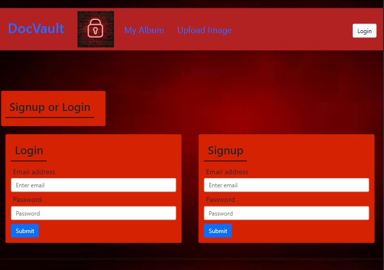

# DocVault

## Our Project

We wanted to create an application that allows users to upload their photos to a filesystem database with login functionality, and then download those photos back to their device whenever needed.

---

## Table of Contents
[User Story](#user-story)

[MVP Functionality](#mvp-functionality)

[Languages Used](#languages-used)

[Project Screenshot](#project-screenshot)

[Links](#links)

[Developers](#developers)

---
## User Story
GIVEN a need to store photos in a personal database 
WHEN I upload a photo to the database 
THEN I am able to login to the application and see that photo therein 
WHEN I create a user 
THEN my photos are saved to that user, and not visible to other users 

---
## MVP Functionality
I am able to create a user account and after logging in I am able to upload photos to the application  

---
## Languages Used
* HTML 
* Javascript
* Node.js 
* Express.js 
* bcrypt 
* Sequelize 
* dotenv 
* handlebars 
* multer
---
## Project Screenshot

---
### Links
[Project GitHub Repo](https://github.com/ValiantThor92/steamShark)  
[Deployed Project on Heroku](https://docvault-app.herokuapp.com/)  

---
### Developers
[Travis](https://github.com/ValiantThor92), [Kaia](https://github.com/Re1d0n), [Jacob](https://github.com/YacobLeonetti), and [Jack](https://github.com/JackyFord)